# 🧠 LogeekMind: The AI Academic Assistant

### Empowering Smarter Learning

[Use the LogeekMind app](https://logeekmind.streamlit.app)

LogeekMind is your all-in-one AI academic productivity platform and educational technology tool built using Streamlit and powered by Google's Gemini AI models. It’s designed to simplify studying, accelerate content mastery, and optimize academic planning for students across all disciplines.

## 🚀 Getting Started

### 🔑 Essential: Get Your Gemini API Key

To access **LogeekMind** AI features (AI Teacher, Homework Assistant, Course Outline Generator, Smart Quiz Generator and Notes Summarizer) the application will prompt you to enter your Gemini API key. Having your own key ensures uninterrupted access to all AI features.

1.  **Sign in to Google AI Studio:** 

Visit the [Google AI Studio](https://aistudio.google.com/welcome).Use your Google account to sign in. If you don't have one, you will need to create it. Click on the Get started option to log in or sign up

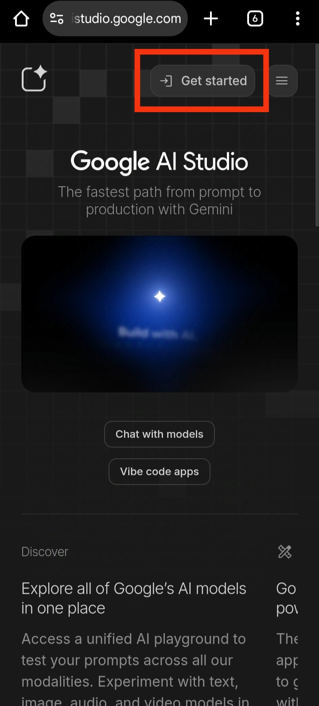

Once you are signed in, you will see the main dashboard.
 
2.  **API Keys Section:** 

After signing in,look for the API Keys option in the dashboard. Click on **'Get API Key'** option.

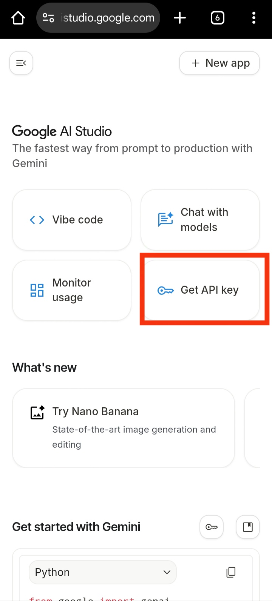

3.  **Create a New Project:** 

On the API Key management page,there's a button that says **"Create API Key"**. Click on it and click on "+Create project" in the dropdown menu that says 'Choose an imported project', give it a name and hit 'Create project'. You should see it in a dropdown list

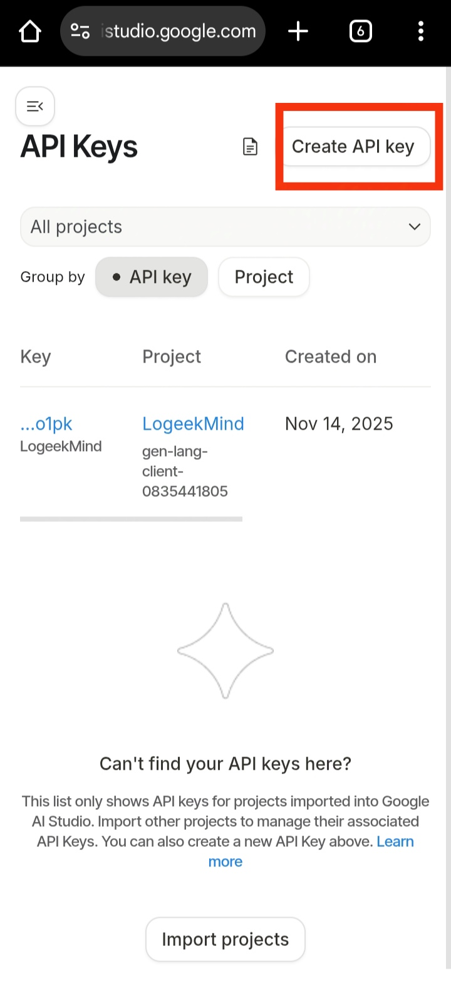

4. **Create Gemini API Key:**

Select the project name from the drop-down list and give your api key a name.Then hit the 'Create Key' button. Google will instantly generate a new key for your project. The key is a long string of letters, numbers, and symbols.

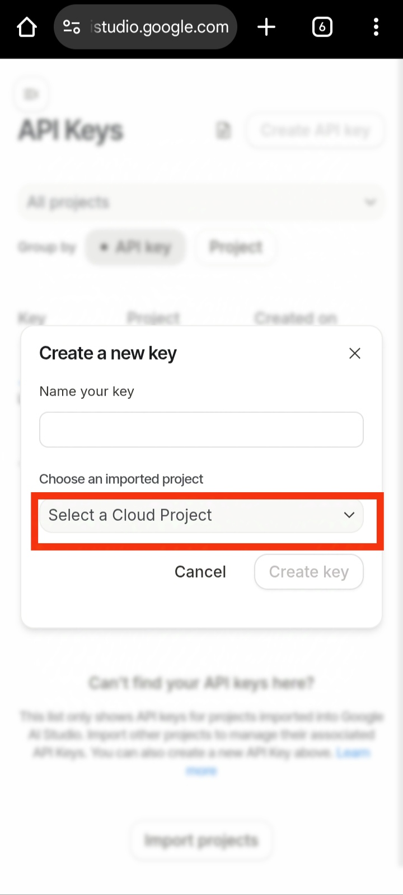

5. **Copy your API Key and store it securely**

After creating your API key, you will see it displayed on the screen in the 'Key' columnn. It looks like a long mix of letters, numbers, and symbols. Copy and store this key somewhere safe so anytime you are prompted by the application to enter your key, you can simply copy and paste this key into the **"API Key Setup"** section in the app's sidebar.


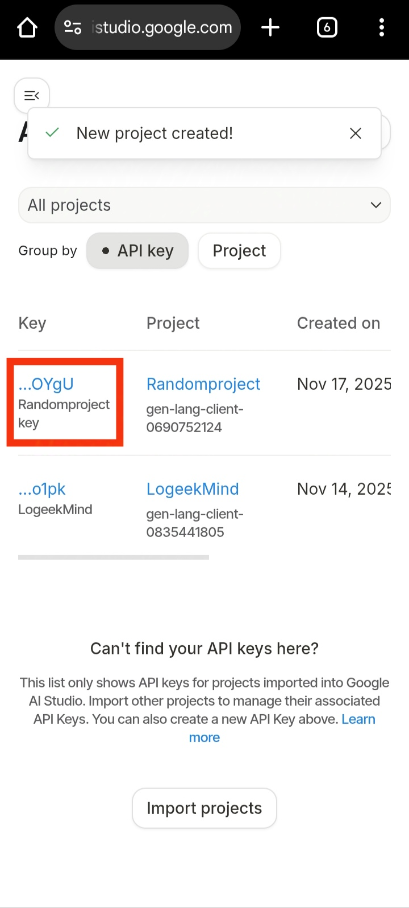

**LogeekMind does not store your API key, it's only saved temporarily for one-app session use, you will be prompted to enter your API key every time you open the application to access AI features.**

***

### Installation and Local Setup

**Make sure you have ffmpeg setup on your system (Required for text to audio feature)**

1.  **Clone the repository:**
    ```bash
    git clone https://github.com/TheLogeek/LogeekMind.git
    cd LogeekMind
    ```

2.  **Create a virtual environment** (recommended):
    ```bash
    python -m venv venv
    source venv/bin/activate  # On Windows, use: venv\Scripts\activate
    ```

3.  **Install dependencies** using your `requirements.txt`:
    ```bash
    pip install -r requirements.txt
    ```

4.  **Run the application:**
    ```bash
    streamlit run LogeekMind.py
    ```

## ✨ Detailed Feature Showcase

LogeekMind combines nine distinct tools, accessible via the sidebar, to streamline your academic journey.

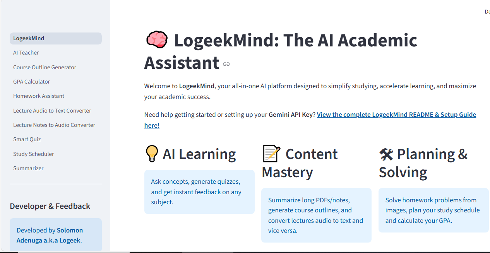

---

### 1. 🤖 AI Teacher

**The Ultimate Study Partner.** This is a persistent, conversational chatbot that acts as your personal tutor. Ask it to explain complex topics, summarize textbook chapters, debate concepts, or review lecture notes. It uses context from your ongoing conversation to provide highly tailored and accurate academic assistance.

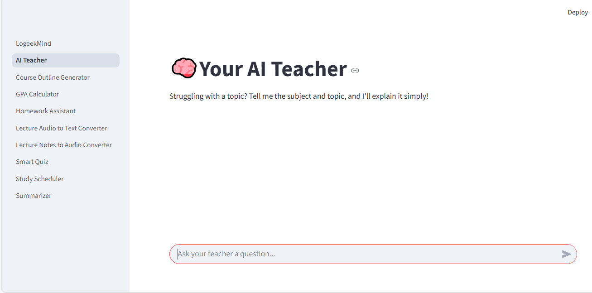


### 2. 📸 Homework Assistant (Multimodal Vision)

**Instant Problem Solver.** Tired of manual input? Simply upload an image (`.jpg`, `.png`) of a handwritten or printed homework problem (e.g., math equation, physics diagram, chemistry structure). The AI will analyze the image and generate a step-by-step, downloadable solution.

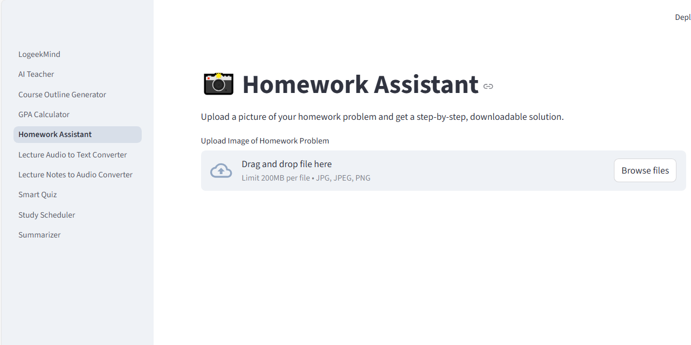


### 3. ❓ Smart Quiz Generator

**Test Your Knowledge.** Quickly create custom, randomized quizzes based on any topic you input. You can specify the number of questions, the type (Multiple Choice, True/False, Short Answer), and the difficulty level (1-5). The quiz is generated with a hidden answer key and detailed explanations, perfect for self-assessment.

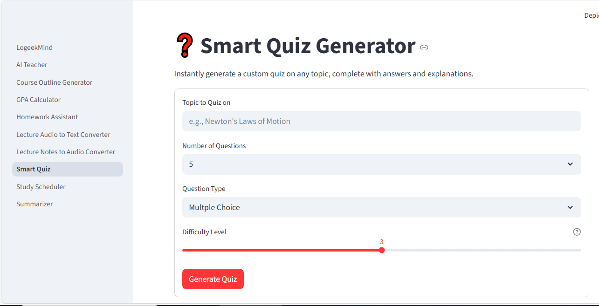


### 4. 📝 Document Summarizer

**Master Your Readings.** Upload large documents, lecture notes, or PDFs. The AI generates concise, actionable summaries tailored to your specified length and format. All generated summaries are instantly downloadable as a .txt file for offline use.

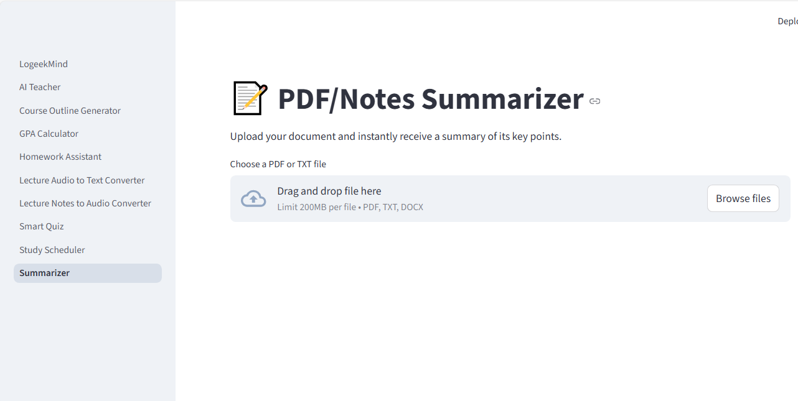


### 5. 📋 Course Outline Generator

**Plan Your Curriculum.** Generate a professional, comprehensive 12-week course syllabus and outline instantly. Input the Course Full Name, Course Code, and optional University Name, and the AI will structure the weekly topics and learning objectives.

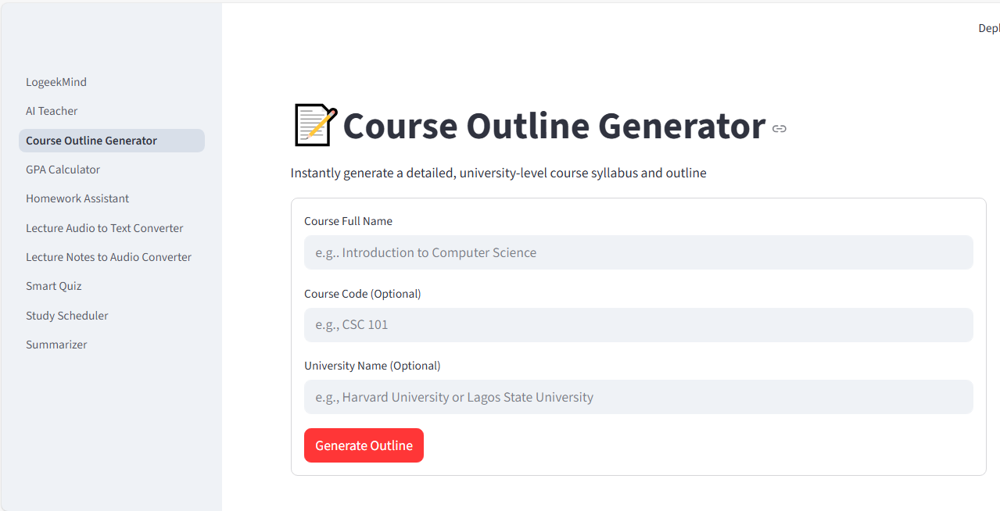


### 6. 🗓️ Study Scheduler

**Organize Your Week.** A powerful utility tool that takes your subject list, priority level (1-5), and estimated weekly study hours to automatically generate a balanced, day-by-day study schedule, clearly displaying time in hours and minutes (e.g., 1h 30m).

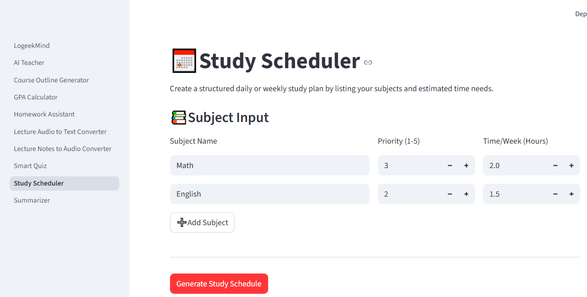


### 7. 🔢 GPA Calculator

**Track Your Progress.** A simple, reliable utility for tracking your current grades, adding new courses, and calculating your current or projected GPA.

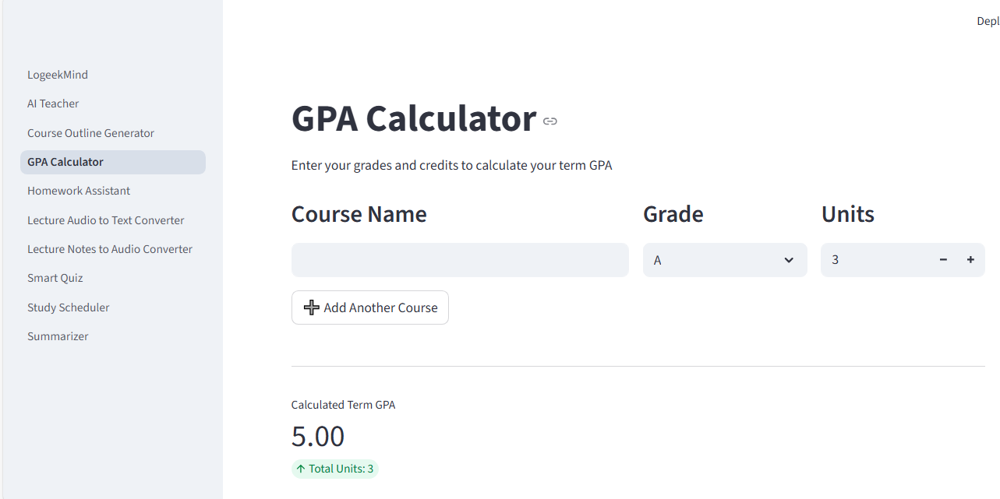


### 8. 🎧 Audio-to-Text (Lecture Converter)

**Transcribe Lectures Instantly.** Upload audio recordings (MP3/WAV/M4A) of lectures or meetings and convert them into a downloadable text transcript using free external APIs.


### 9. 🗣️ Text-to-Audio (Notes to Audio)

**Create Audio Notes.** Convert any block of text—your summaries, flashcards, or key definitions—into a high-quality MP3 audio file, allowing you to study on the go.


---

## 🆕 What's New in v1.1.0

There's a major update for the Notes-to-Audio Converter!

* **File Upload Support:** You can now upload lecture notes directly from `.txt`, `.pdf`, `.docx` files, making it easier to process large documents.
* *Other minor bug fixes/improvements in the summarizer...*

[See the full release notes here](https://github.com/TheLogeek/LogeekMind/releases/tag/v1.1.0)


## 🤝 Developer & Feedback

LogeekMind was conceptualized,developed and maintained by **[Solomon Adenuga]** with a focus on delivering robust, student-centric educational technology tools.

If you encounter any issues, find a bug, or have a brilliant feature suggestion, your feedback is highly valued!

* 📧 **Email:** [solomonadenuga8@gmail.com](solomonadenuga8@gmail.com)
* 📱 **WhatsApp (Bug Reports):** [+2348023710562](https://wa.me/+2348023710562)

---

## License

This project is licensed under the License - see the [LICENSE](LICENSE) file for details.
```