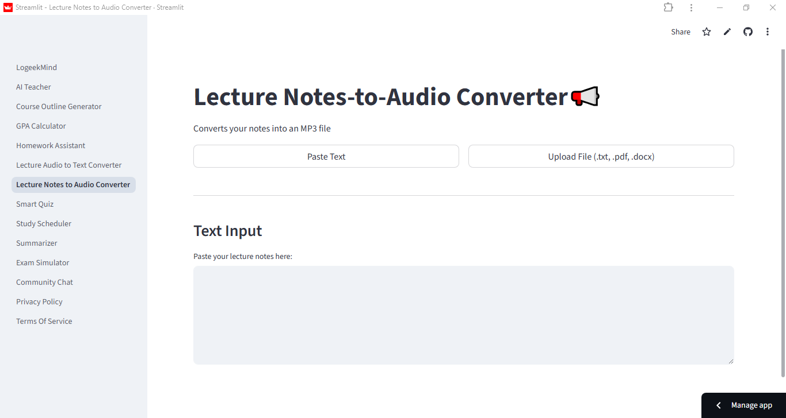
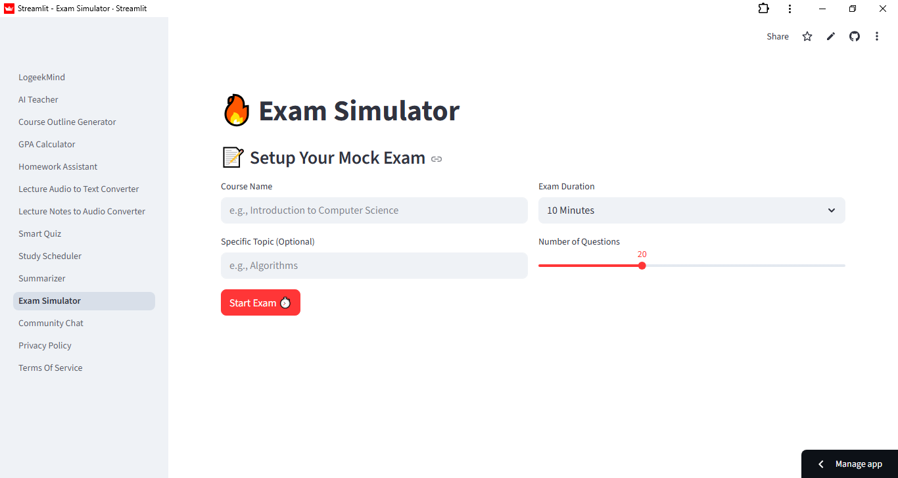

# 🧠 LogeekMind: The AI Academic Assistant

### Empowering Smarter Learning

[Use the LogeekMind app](https://logeekmind.streamlit.app)

LogeekMind is your all-in-one AI academic productivity platform and educational technology tool built using Streamlit and majorly powered by Google's Gemini AI models. It’s designed to simplify studying, accelerate content mastery, and optimize academic planning for students across all disciplines.

## 🚀 Getting Started

[Use the LogeekMind web app (mobile phone, pc)](https://logeekmind.streamlit.app)

[Download the LogeekMind Android app](https://web2apkpro.com/public_download.php?project_id=5817&token=f40853c879)

### 🔑 Get Your Gemini API Key: [Read the full LogeekMind tutorial on how to get a Gemini API key](https://thelogeek.github.io/LogeekMind/api-setup.html)


### Installation and Local Setup

**Make sure you have ffmpeg setup on your system (Required for text to audio feature)**

1.  **Clone the repository:**
    ```bash
    git clone https://github.com/TheLogeek/LogeekMind.git
    cd LogeekMind
    ```

2.  **Create a virtual environment** (recommended):
    ```bash
    python -m venv venv
    source venv/bin/activate  # On Windows, use: venv\Scripts\activate
    ```

3.  **Install dependencies** using your `requirements.txt`:
    ```bash
    pip install -r requirements.txt
    ```

4.  **Run the application:**
    ```bash
    streamlit run LogeekMind.py
    ```

## ✨ Detailed Feature Showcase

LogeekMind combines ten distinct tools, accessible via the sidebar, to streamline your academic journey.


---

### 1. 🤖 AI Teacher

**The Ultimate Study Partner.** This is a persistent, conversational chatbot that acts as your personal tutor. Ask it to explain complex topics, summarize textbook chapters, debate concepts, or review lecture notes. It uses context from your ongoing conversation to provide highly tailored and accurate academic assistance.


### 2. 📸 Homework Assistant (Multimodal Vision)

**Instant Problem Solver.** Tired of manual input? Simply upload an image (`.jpg`, `.png`) of a handwritten or printed homework problem (e.g., math equation, physics diagram, chemistry structure). The AI will analyze the image and generate a step-by-step, downloadable solution.


### 3. ❓ Smart Quiz Generator

**Test Your Knowledge.** Quickly create custom, randomized quizzes based on any topic you input. You can specify the number of questions, the type (Multiple Choice, True/False), and the difficulty level (1-5). The quiz is interactive and users get instantly graded after submitting and get detailed explanations, perfect for self-assessment.


### 4. 📝 Document Summarizer

**Master Your Readings.** Upload large documents, lecture notes, or PDFs. The AI generates concise, actionable summaries tailored to your specified length and format. All generated summaries are instantly downloadable as a .txt file for offline use.


### 5. 📋 Course Outline Generator

**Plan Your Curriculum.** Generate a professional, comprehensive 12-week course syllabus and outline instantly. Input the Course Full Name, Course Code, and optional University Name, and the AI will structure the weekly topics and learning objectives.


### 6. 🗓️ Study Scheduler

**Organize Your Week.** A powerful utility tool that takes your subject list, priority level (1-5), and estimated weekly study hours to automatically generate a balanced, day-by-day study schedule, clearly displaying time in hours and minutes (e.g., 1h 30m).


### 7. 🔢 GPA Calculator

**Track Your Progress.** A simple, reliable utility for tracking your current grades, adding new courses, and calculating your current or projected GPA.


### 8. 🎧 Audio-to-Text (Lecture Converter)

**Transcribe Lectures Instantly.** Upload audio recordings (MP3/WAV/M4A) of lectures or meetings and convert them into a downloadable text transcript using free external APIs.


### 9. 🗣️ Text-to-Audio (Notes to Audio)

**Create Audio Notes.** Convert any block of text—your summaries, flashcards, or key definitions or uploaded
document files—into a 
high-quality MP3 audio file, allowing you to study on the go.




### 10. Exam Simulator

The Exam Simulator transforms the preparation process from casual quizzing into a high-pressure, academic assessment environment. This feature is designed to accurately gauge a user's readiness for their final examinations by enforcing strict time limits and using formal grading metrics.

Key Functional Features:

Timed Assessment: Users set a fixed duration for the exam. A non-pausable, real-time countdown timer is displayed throughout the session to mimic actual exam conditions.

Auto-Submission Engine: The system automatically submits and grades the user's progress the moment the timer reaches zero, enforcing discipline and replicating the finality of a real test.

University-Standard Questioning: Leverages the Gemini API to generate challenging, application-based multiple-choice questions specific to the provided course code and topic.

Formal Academic Grading: Results are translated into an official A, B, C, D, E, or F academic grade (based on percentage score), providing a clear and non-ambiguous metric of readiness.




---

## 🆕 What's New in v1.1.0

There's a major update for the Notes-to-Audio Converter!

* **File Upload Support:** You can now upload lecture notes directly from `.txt`, `.pdf`, `.docx` files, making it easier to process large documents.
* *Other minor bug fixes/improvements in the summarizer...*

[See the full release notes here](https://github.com/TheLogeek/LogeekMind/releases/tag/v1.1.0)

---

## 🆕 What's New in v1.2.0

**Community Chat:** LogeekMind's users can now exchange live text messages with the new community chat feature.

---

## 🆕 What's New in v1.2.1

* Users can now use LogeekMind's AI features without having to enter their own gemini api key however they will be given 
an option to enter theirs if they want to.
* Handles Robust Rate Limiting

---

## 🆕 What's New in v1.2.2

Updated privacy policy and terms of service

---

## 🆕 What's New in v1.3.0

Updated Smart Quiz Generator: Now interactive; users can select options and get instantly graded and view explanations after submitting.

## 🆕 What's New in v1.4.0

Major New feature introduced: Exam Simulator.

## 🆕 What's New in v1.4.1

Fixed major bugs in Exam Simulator.

## 🆕 What's New in v1.5.0

- Implementation of Authentication for users (Login and Signup).

- User Dashboard for performance metrics now available.

- New Community Chat user interface and improved user experience

## 🆕 What's New in v1.5.1

- Improved AI Teacher user experience

- Fixed bugs in Lecture Notes-to-Audio converter and AI Teacher.

---

Access the LogeekMind full documentation here: https://thelogeek.github.io/LogeekMind/
---


## 🤝 Developer & Feedback

LogeekMind was conceptualized,developed and maintained by **[Solomon Adenuga]** with a focus on delivering robust, student-centric educational technology tools.

If you encounter any issues, find a bug, or have a brilliant feature suggestion, your feedback is highly valued!

* 📧 **Email:** [solomonadenuga8@gmail.com](solomonadenuga8@gmail.com)
* 📱 **WhatsApp (Bug Reports):** [+2348023710562](https://wa.me/+2348023710562)

---

## License

This project is licensed under the License - see the [LICENSE](LICENSE) file for details.
```